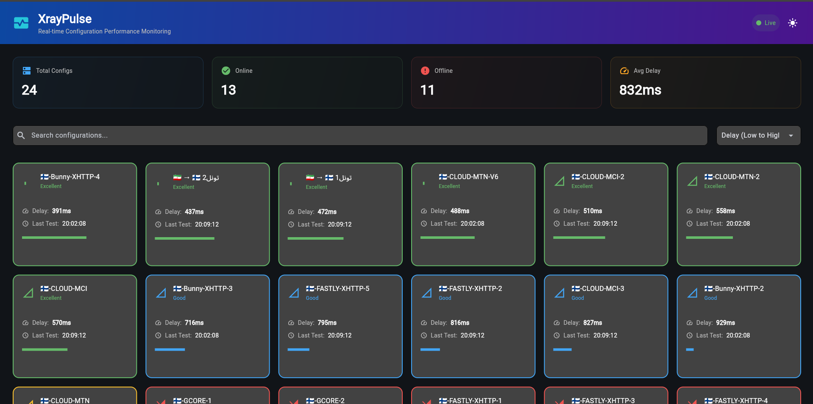
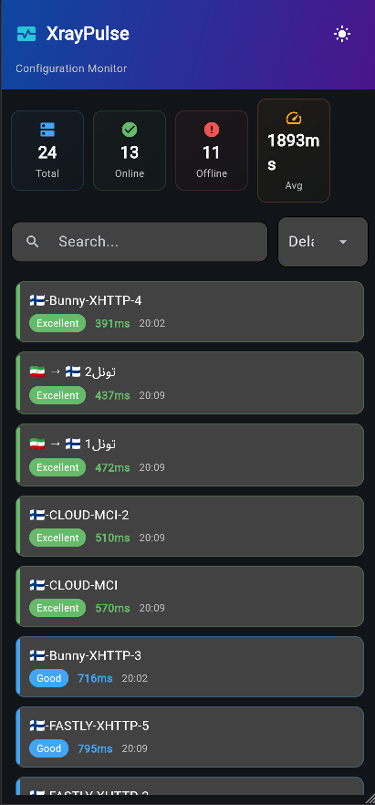

# XrayPulse - Xray Config Monitor

## Project Screenshots





## Project Structure
```
XrayPulse/
├── monitor.py           # Main monitoring application
├── web_interface.py      # Web interface
├── convert.py           # Config converter (from existing project)
├── configs/             # Stores converted configs (auto-created)
├── ping_results.json    # Test results (auto-created)
├── monitor.log         # Application logs (auto-created)
└── core/               # Xray binaries
    ├── win/
    │   └── xray.exe
    ├── linux/
    │   └── xray
    └── macos/
        └── xray
```

## 📋 Requirements

### Python Dependencies
```bash
pip install -r requirements.txt
```

### Additional Files Needed
Ensure you have Xray binary installed in:
   - Windows: `./core/win/xray.exe`
   - Linux: `./core/linux/xray`
   - macOS: `./core/macos/xray`

## 🚀 Installation Steps

### 1. Clone Project
```bash
git clone https://github.com/wikm360/XrayPulse.git
cd XrayPulse
```

## 🎯 Usage

### Starting the Monitor

1. **Run the main monitor:**
```bash
python monitor.py
```

2. **Enter your subscription URL when prompted**
   - The URL will be saved for future use
   - Configs will be fetched and converted automatically

3. **Access the web dashboard:**
   - Open browser: `http://127.0.0.1:7070`
   - Dashboard updates automatically every 10 seconds

### Features

#### Main Monitor (monitor.py)
- ✅ Fetches configs from subscription URL
- ✅ Converts vmess/vless to Xray JSON format
- ✅ Tests each config every 5 minutes (configurable)
- ✅ Saves results to `ping_results.json`
- ✅ Runs continuously with error handling

#### Web Dashboard (web_interface.py)
- ✅ Modern, responsive design
- ✅ Real-time statistics
- ✅ Grid, Chart, and Table views
- ✅ Search and sort functionality
- ✅ Dark/Light theme toggle
- ✅ Auto-refresh every 10 seconds
- ✅ Color-coded status indicators

### Configuration Options

#### Change Test Interval
In `monitor.py`, modify the interval (in seconds):
```python
# Default is 300 seconds (5 minutes)
self.tester.start(interval=300)
```

#### Change Web Port
In `monitor.py`, modify the web server port:
```python
  self.web_server = subprocess.Popen(
      ["flet", "run", "-w", "-p", "7070", "web_interface.py"]
  ) # Change 7070 to desired port
)
```

## 🔧 Troubleshooting

### Common Issues

1. **Xray binary not found**
   - Ensure Xray is in the correct path under `./core/`
   - Or install Xray system-wide

2. **Permission denied (Linux/macOS)**
   ```bash
   chmod +x ./core/linux/xray
   chmod +x ./core/macos/xray
   ```

3. **Port already in use**
   - Change the web server port in `monitor.py`
   - Or kill the process using the port

4. **Configs not converting**
   - Ensure `convert.py` is in the same directory
   - Check that the subscription returns valid vmess/vless configs

### Logs
Check `monitor.log` for detailed error messages and debugging information.

## 📊 Understanding Results

### Delay Categories
- **Excellent**: < 100ms (Green)
- **Good**: 100-300ms (Blue)
- **Fair**: 300-500ms (Orange)  
- **Poor**: > 500ms (Yellow)
- **Offline**: No response (Red)

### Results File Format
```json
{
  "last_update": "2024-01-01T12:00:00",
  "total_configs": 10,
  "results": {
    "Config Name": {
      "delay": 150.5,
      "timestamp": "2024-01-01T12:00:00",
      "status": "online"
    }
  }
}
```

## 🛑 Stopping the Monitor

Press `Ctrl+C` in the terminal to gracefully stop all components.

## 📝 License

This project uses components from the original Xray Client project.
Ensure you comply with all relevant licenses.

## 🤝 Support

For issues or questions:
1. Check the logs in `monitor.log`
2. Ensure all dependencies are installed
3. Verify Xray binary compatibility with your system
